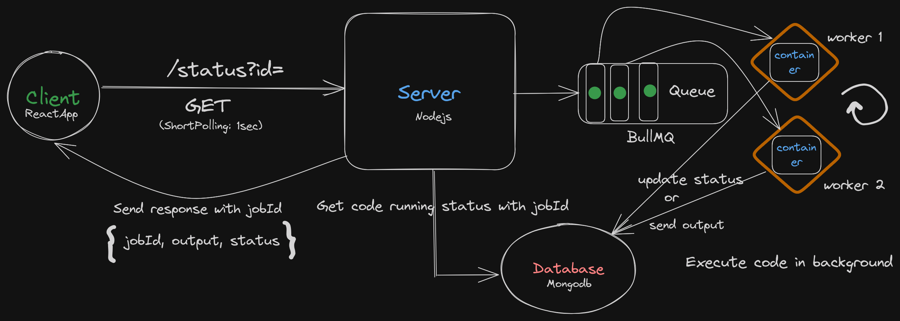

# Code Compiler

### A user friendly online code compiler 📝

 

 

**Todo :**
- [ ] Implement code support for python, js, sql etc
- [ ] Create authentication for users/admin
- [X] Add support for saving code to a DB
- [X] Statistics for code run like - time taken, timestamp
- [ ] Improve error message support to ease debugging
- [ ] Improve the UI - use Bootstrap, FontAwesome, AceEditor etc
- [X] Implement MQs to queue tasks
- [ ] Deploy code in EC2 instance and add docker support for executing different language codes
